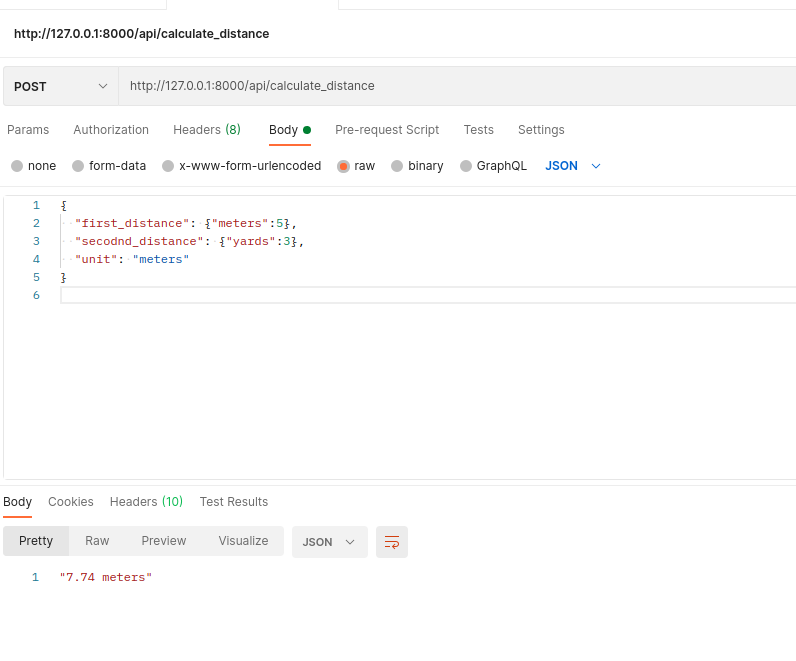

# service distance calculator
Make a web service that accepts two distances (numbers) and returns the total distance (sum)

# Files
added a route under Api directory

created a controller to handle the requests

## added 2 functions
 
1. processData - To proess the incoming request and neccesary validation
2. get_distance - To calcute distance
	- parametes(unit,array data) -> returns a float
	
## Setup

## Steps

## clone the repository

Open your terminal,

## Then

on you project directory run the following commands

Please make sure you have composer installed

https://getcomposer.org/

# Dependencies
$ composer install

## Finally
$ php artisan serve
	
	
## example
POST http://127.0.0.1:8000/api/calculate_distance
Content-Type: application/json

{
  "first_distance": {"meters":5},
  "second_distance": {"yards":3},
  "unit": "meters"
}

## response	
"7.74 meters"
	
